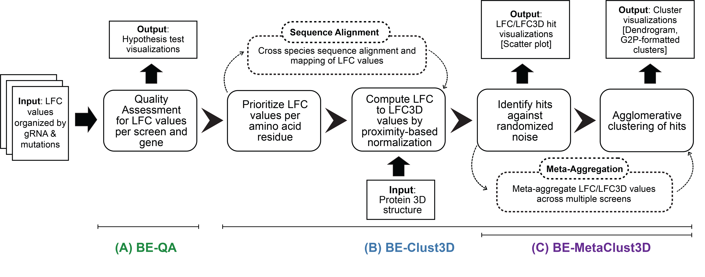
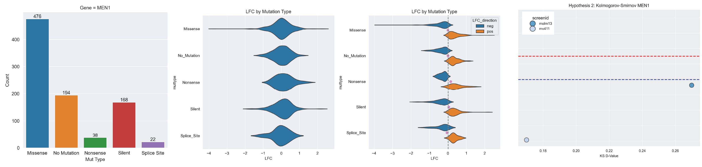
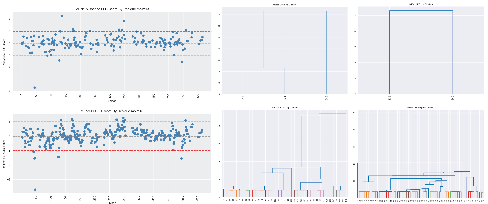
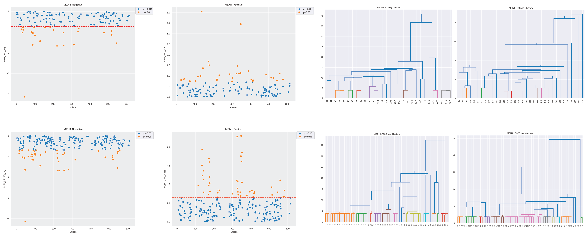
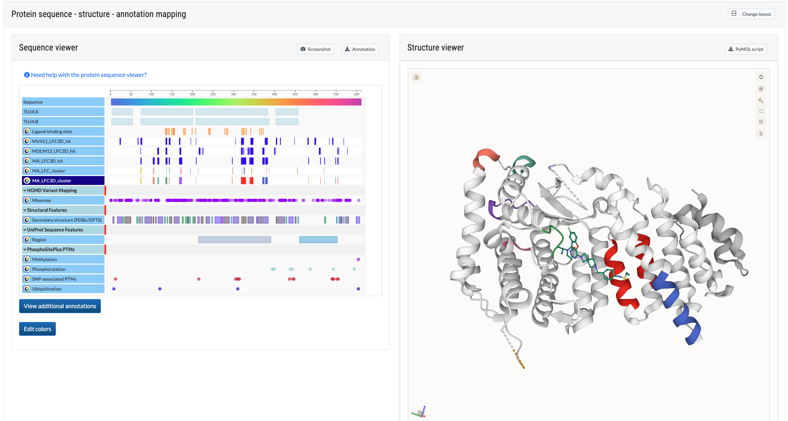

# BE3D

**BE3D** is a Python package for interpreting structure-function relationships in base editor (BE) tiling mutagenesis data. The workflow includes quality assessment of screen data, extrapolation of BE signals onto 3D structures, and identification of significant residues or clusters (hotspots) from a structure-function perspective. 

You can run the BE3D pipeline either:
- On **Google Colab** (no installation required), or
- **Locally** (faster execution).

---

## Overview

- **[Workflow](#workflow)**
- **[Input](#input)**
- **[Features](#features)**
    - **[Quality Assessment](#quality-assessment-hypothesis-test-visualization)**
    - **[3D-based Scoring and Visualization](#be-clust3d-visualization-of-lfc-and-lfc3d-hits)**
    - **[Meta-Aggregation](#be-metaclust3d)**
    - **[Genomics 2 Portal Output](#visualization-on-the-genomics-2-portal)**
- **[Installation](#installation)**
- **[Examples](#getting-started)**
- **[License](#license)**

## Workflow

The following figure provides an overview of the BE3D workflow:



BE3D enables structure-function analysis of BE tiling mutagenesis data by mapping mutation readouts (log fold change, LFC) onto 3D protein structures. This can be extended to multiple screens or cross-species comparisons. The workflow consists of:

**A. BE-QA**: Assesses the quality of BE screens by testing if knockout (e.g., nonsense or splice site) and neutral (e.g., silent) mutations have significantly different LFC distributions.

**B. BE-Clust3D**: Maps LFC values onto 3D protein structures and computes a per-residue 3D-normalized LFC score (LFC3D), based on spatial proximity (default: 6 Å).

**C. BE-MetaClust3D**: Aggregates data from multiple screens to enhance signal strength and detect sites that might be missed due to variability.

## Input

BE3D requires the following inputs:

1. **BE Readouts (TSV)**: Must include Mutation Category, Amino Acid Edit, Gene Name, and Score. You must map column names in the config.

    Example TSV:

    ```tsv
    predicted_edit	delta_beta_score	mutation_category	Gene Symbol
    Gly2Arg;Met1Ile	-0.18977	Missense	MEN1
    Leu10Leu	        -0.22247	Silent		MEN1
    ```

    Example config (Python):

    ```python
    mut_col = "mutation_category"
    val_col = "delta_beta_score"
    gene_col = "Gene Symbol"
    edits_col = "predicted_edit"
    ```

2. **Uniprot ID**: Required to fetch protein sequence and structure from UniProt/AlphaFold.

3. **Optional FASTA and PDB**: Provide custom protein sequence and structure files for non-human proteins or alternative structures.

    ```python
    input_pdb = 'men1_AF3.pdb'
    input_fasta = 'men1.fasta'
    ```

## Features

### Quality Assessment: Hypothesis Test Visualization

BE-QA performs Mann-Whitney and Kolmogorov-Smirnov tests on LFC distributions, comparing knockout and neutral mutations. Results are visualized with statistical annotations.



### BE-Clust3D: Visualization of LFC and LFC3D Hits

BE-Clust3D prioritizes residues by aggregating LFC values within a defined spatial range. This enhances signal detection by computing LFC3D scores. Results are visualized and can be clustered.



### BE-MetaClust3D

Supports aggregation across multiple screens to identify consensus hotspots or hidden signals.



### Visualization on the Genomics 2 Portal

Results are provided in G2P-compatible TSVs, viewable at [Genomics 2 Portal](https://g2p.broadinstitute.org/mapping).



## Installation

Install BE3D using pip:

```bash
pip install git+https://github.com/broadinstitute/BEClust3D.git
```

## Getting Started

### Example 1: MEN1 (Local)

The script `Example/men1.py` runs BE3D on two screens. Customize this script for your use case.

```python
if __name__ == '__main__':
    ...
    screens = 'molm13.tsv,mv411.tsv'
    input_gene = 'MEN1'
    input_uniprot = 'O00255'
    input_pdb = 'men1_AF3.pdb'
    input_fasta = 'men1.fasta'
    ...
```

### Example 2: MEN1 (Colab)

Try it in Colab:  
[](https://colab.research.google.com/github/broadinstitute/EmmaEmb/blob/main/examples/Pla2g2/emmaemb_pla2g2.ipynb)

## License

This project is licensed under the MIT License - see the [LICENSE](LICENSE) file for details.
