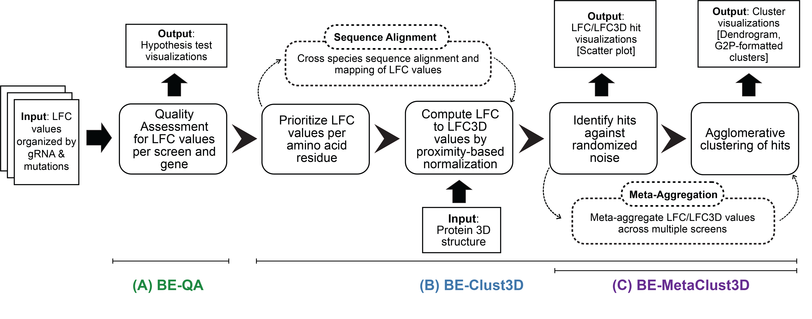
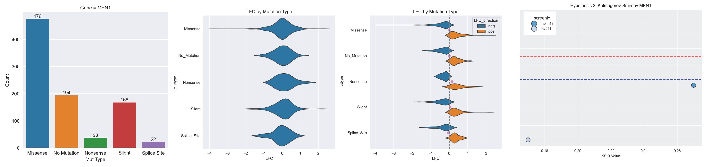
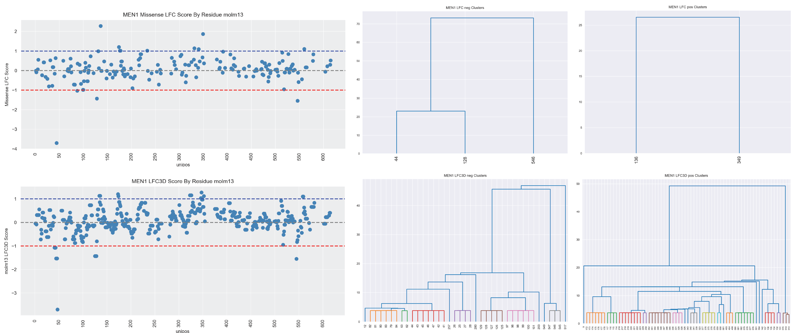
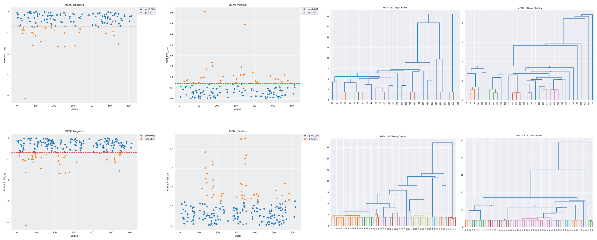
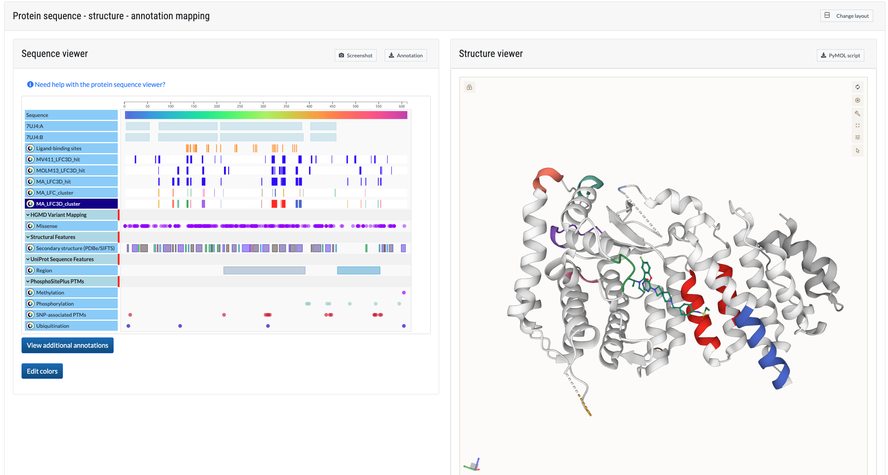

# BE3D (BEClust3D)

**BE3D (or BEClust3D)** is a Python package for interpreting structure-function relationships in base editor (BE) tiling mutagenesis data. The workflow includes 3 main modules: quality assessment of screen data by gene, extrapolation of BE screen signals onto 3D structures and identification of significant residues and clusters (hotspots) from a structure-function perspective, and aggregation of multiple screens for the idenficiation of signficiant residues and clusters. 

You can run the BE3D pipeline either:
- On **Google Colab** (no installation required), or
- **Locally** (faster execution).

---

## Overview

- **[Workflow Overview](#workflow-overview)**
- **[Input](#input)**
- **[Features](#features)**
    - **[Quality Assessment](#quality-assessment-hypothesis-test-visualization)**
    - **[3D-based Scoring and Visualization](#be-clust3d-visualization-of-lfc-and-lfc3d-hits)**
    - **[Meta-Aggregation](#be-metaclust3d)**
    - **[Genomics 2 Portal Output](#visualization-on-the-genomics-2-portal)**
- **[Installation](#installation)**
- **[Examples](#getting-started-examples)**
- **[Some Extra Notes](#notes)**
- **[Google Colab Notebooks](#sample-google-colab-notebooks)**
- **[License](#license)**

## Workflow Overview

The following figure provides an overview of the BE3D workflow:

[### Need to replace this with new Figure 1 schematic. ###]



BE3D enables structure-function analysis of BE tiling mutagenesis data by mapping mutation readouts (log fold change, LFC) onto 3D protein structures. This can be extended to multiple screens or cross-species comparisons. The workflow consists of:

**A. BE-QA**: Assesses the quality of BE screens by testing if knockout annotated (e.g., nonsense or splice site) and neutral annotated (e.g., silent or no mutation) guides have significantly different LFC score distributions.

**B. BE-Clust3D**: Maps LFC values by amino acid residue onto 3D protein structures and computes a per-residue 3D-normalized LFC score (LFC3D score) based on spatial proximity (default: 6 Å). Then, agglomerative clustering is performed with a second spatial proximity parameter (default: 6 Å) to identify hotspots of potential functional importance. 

**C. BE-MetaClust3D**: Aggregates data from multiple screens to enhance signal strength and detect residues that might be missed due to the noise present base editing screens. 

## Input

BE3D requires the following inputs:

1. **BE Screen Scores (TSV)**: Must include Mutation Category, Amino Acid Edit, Gene Name, and Score. You must map column names in the config.

    Example TSV:

    ```tsv
    predicted_edits	sgRNA_score	mutation	Gene
    Gly2Arg;Met1Ile	-0.18977	Missense	MEN1
    Leu10Leu	-0.22247	Silent		MEN1
    ```

    Example input config (Python):

    ```python
    mut_col   = "mutation"
    val_col   = "sgRNA_score"
    gene_col  = "Gene"
    edits_col = "predicted_edits"
    ```

2. **Uniprot ID**: Required to fetch protein sequence and structure from UniProt/AlphaFold.

    ```python
    input_uniprot = "O00255" # (MEN1)
    ```

4. **Optional FASTA and PDB**: Provide custom protein sequence and structure files for non-canonical sequences, non-canonical proteins, or alternative structures. If these ields are left empty, the pipeline fetches the AlphaFold of the canonical isoform structure for the given Uniprot ID, so any other sequences or PDB structures would need to be linked manually like this. 

    ```python
    input_pdb   = 'men1_AF3.pdb'
    input_fasta = 'men1.fasta'
    ```

## Features

### Quality Assessment: Hypothesis Test Visualization

BE-QA performs Mann-Whitney and Kolmogorov-Smirnov tests on LFC distributions, comparing knockout and neutral mutations. Knowckout mutations of a single gene in a single screen are compared against neutral mutations of that single gene (hypothesis 1) or neutral mutations of all genes in that screen (hypotehsis 2). Results are visualized with statistical annotations.



### BE-Clust3D: Visualization of LFC and LFC3D Hits

BE-Clust3D prioritizes residues by aggregating LFC values within a defined spatial range. This enhances signal detection by computing LFC3D scores. Results are visualized and can be clustered. 

This step also includes the preprocessing of scores organized by sgRNA to scores organized by residues, running sequence alignment to combine screens on different genes, and the calculation of p-values to define statistical thresholds for defining a hit. 



### BE-MetaClust3D

BE-MetaClust3D aggregates across multiple screens to identify consensus hotspots or enhance weaker signals across multiple screens. 



### Visualization on the Genomics 2 Portal

Results are provided in G2P-compatible TSV file, which can be downloaded and interactively viewable in [Genomics 2 Portal](https://g2p.broadinstitute.org/mapping).



## Installation

Install BE3D using pip:

```bash
pip install git+https://github.com/broadinstitute/BEClust3D.git
```

This code block is in Google Colab notebooks (see below)

## Getting Started Examples

### Example 1: MEN1 (Local)

The script `Example/men1.py` runs BE3D on two screens. Customize this script for your use case.

```python
if __name__ == '__main__':
    ...
    screens = 'molm13.tsv,mv411.tsv'
    input_gene = 'MEN1'
    input_uniprot = 'O00255'
    input_pdb = 'men1_AF3.pdb'
    input_fasta = 'men1.fasta'
    ...
```

## Notes

### Structure

The pipeline automatically queries the UNIPROT protein sequence and AlphaFold structure of the protein of interest. If users want to use a PDB or other custom structure, they would need to upload the ```structure.pdb``` file and provide the filepath to the structure. 

The pipeline also automatically uses DSSP to annotate a pdb file for secondary structures. However, this tool is known to sometimes fail on larger structures. Furthermore, for a custom PDB upload, it is recommended that the user uploads their own DSSP file, as DSSP may fail on these structures. The annotations for DSSP are not necessary for the pipeline until the final characterization step, and would not affect preprocessing, prioritizing hits, meta-aggregation, or clustering. 

The DSSP Web Portal is here: https://pdb-redo.eu/dssp

### Conservation

For sequence alignment, the pipeline runs MUSCLE locally in order to align 2 sequences in order to compare between isoforms or across species. 

For running CLUSTAL, the associated formating packages do not work for arm machines (ie M1/M2/M3 MacBooks). However, the packages should download for Windows and Linux based machines. If the user is using an arm machine, it is recommended to set the mode to 'query' instead of 'run', which calls the MUSCLE API. 

If MUSCLE or CLUSTAL cannot be run locally, the pipeline queries the MUSCLE API, although this may also fail due to issues with the API. Running the MUSCLE API also skips the next step using CLUSTAL. 

Another option to skip MUSCLE and CLUSTAL is for users to run alignment on their own in a CLUSTAL format, and provide the ```sequence.align``` alignment file into the pipeline which is one of the optional inputs. 

## Sample Google Colab Notebooks

Single Screen Notebook Example (DNMT3A): 
[](https://colab.research.google.com/github/broadinstitute/BE3D/blob/main/examples/BEClust3Dv5_SingleScreen_Notebook.ipynb)

Multi Screen Notebook with Meta-Aggregation Example (MEN1): 
[](https://colab.research.google.com/github/broadinstitute/BE3D/blob/main/examples/BEClust3Dv5_MultiScreen_Notebook.ipynb)

Multi Screen Notebook with Meta-Aggregation and Conservation Example: 
[](https://colab.research.google.com/github/broadinstitute/BE3D/blob/main/examples/BEClust3Dv5_MultipleScreensConservation_Notebook.ipynb)

## License

This project is licensed under the MIT License - see the [LICENSE](LICENSE.txt) file for details.
